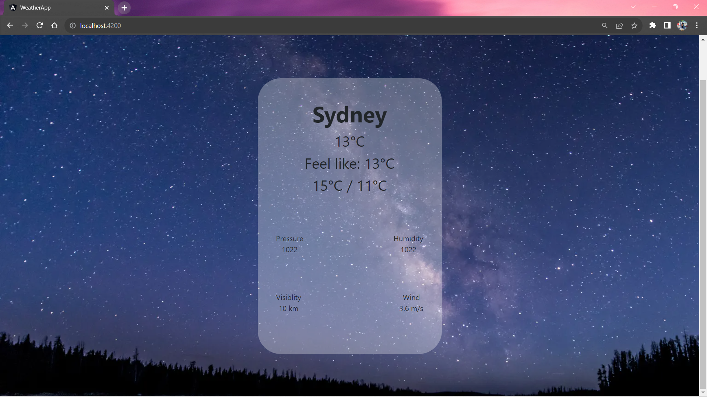
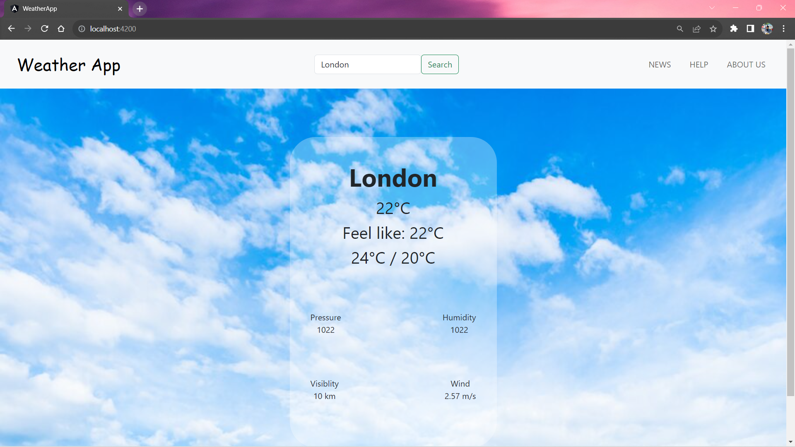
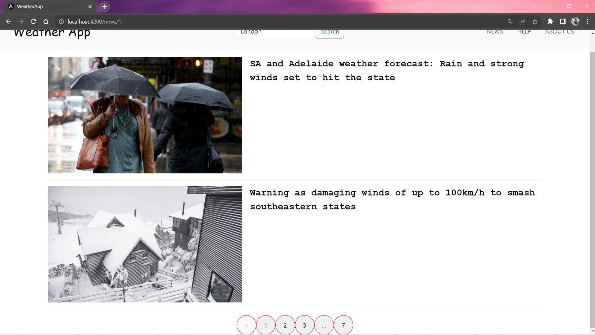

# Weather Website

Welcome to the repository of our Weather Website! If you're curious about the forecast, you're in the right place. With our platform, get quick and accurate weather updates right at your fingertips using data from OpenWeatherMap.

# Features

## Weather Lookup:
- Current Weather: Get real-time weather conditions for any location.
- Forecast: Explore hourly or daily forecasts to plan ahead.
## User-Friendly Interface:
- Clean and intuitive design for easy navigation.
- Visual representations including charts, icons, and more.

# Tech Stack
- Framework: Angular
- Weather Data: API calls to OpenWeatherMap

# Getting Started

## Setup

### Clone the Repository:
- git clone https://github.com/phthien241/Simple-Weather-App
- cd Simple-Weather-App

### Install Dependencies:
- npm install

### Run the Application:
- ng serve

# Demo

